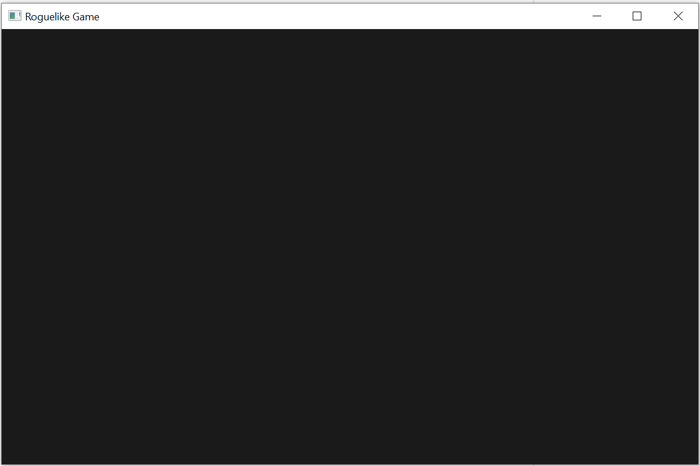

# Draw "@" symbol and moving around

## Showing an empty black window with Bevy

Let's change the code in `main.rs` to the following:
```rust, noplayground
use bevy::prelude::{App, ClearColor, Color, DefaultPlugins, WindowDescriptor};

fn main() {
    App::new()
        .insert_resource(WindowDescriptor {
            title: "Roguelike Game".to_string(),
            width: 80.0 * 10.0,
            height: 50.0 * 10.0,
            ..Default::default()
        })
        .insert_resource(ClearColor(Color::rgb(0.1, 0.1, 0.1)))
        .add_plugins(DefaultPlugins)
        .run();
}
```

And we get the following window:



This part: 
```rust, noplayground
        .insert_resource(WindowDescriptor {
            title: "Roguelike Game".to_string(),
            width: 80.0 * 22.0,
            height: 50.0 * 36.0,
            ..Default::default()
        })
```
is responsible for the creation of the window. 10 is the number of pixels in our font. 80 and 50 are the number of columns and lines we will have in our window.

This line is responsible for almost black color of the background:
```rust, noplayground
        .insert_resource(ClearColor(Color::rgb(0.1, 0.1, 0.1)))
```

And this part:
```rust, noplayground
        .add_plugins(DefaultPlugins)
```
adds default plugins of Bevy to the game engine.

## Adding PNG font to resources

In this tutorial I used the font `DejaVu Sans Mono`. I found a PNG file of this font [here](https://allfont.ru/download/dejavu-sans-mono/). Then edited it a bit and got the PNG that I liked. You can download the font from `code/chapter02/assets/DejaVu Sans Mono22.png` in the repository of this tutorial.

To load the PNG font I added the following code to `main.rs`:

```rust, noplayground
fn setup(
    mut commands: Commands,
    asset_server: Res<AssetServer>,
    mut texture_atlases: ResMut<Assets<TextureAtlas>>,
) {
    // Setup the sprite sheet
    let texture_handle = asset_server.load("DejaVu Sans Mono22.png");
    let texture_atlas = TextureAtlas::from_grid(texture_handle, Vec2::new(22.0, 36.0), 31, 7);
    let texture_atlas_handle = texture_atlases.add(texture_atlas);
}
```

I also added the following line:
```rust, noplayground
        .add_startup_system(setup)
```

to the `main` function:
```rust, noplayground
fn main() {
    App::new()
        .insert_resource(WindowDescriptor {
            title: "Roguelike Game".to_string(),
            width: 80.0 * 22.0,
            height: 30.0 * 36.0,
            ..Default::default()
        })
        .insert_resource(ClearColor(Color::rgb(0.1, 0.1, 0.1)))
        .add_startup_system(setup)
        .add_plugins(DefaultPlugins)
        .run();
}
```

The code is running, but nothing has changed because nothing yes uses the texture atlas.

## Drawing the `@` symbol
Let's create the player Entity and assign the `@` symbol:

First we need to define the player component:
```rust, noplayground
#[derive(Component)]
pub struct Player;
```

Then we should add the camera and the creation of the player to the `setup()` function:
```rust, noplayground
    // Add a 2D Camera
    commands.spawn_bundle(OrthographicCameraBundle::new_2d());


    // Spawn the player
    commands
        .spawn()
        .insert(Player)
        .insert_bundle(SpriteSheetBundle {
            texture_atlas: texture_atlas_handle,
            transform: Transform::from_translation(Vec3::new(0., 0., 0.)),
            sprite: TextureAtlasSprite::new(94),
            ..Default::default()
        });
```

We need the camera to render our sprites.

The player entity is created with the `spawn()` command and then we add components to this entity. To identify that this is a player we add the `Player` component. To add a sprite we add a `SpriteSheetBundle`. 
- `texture_atlas` is the atlas with our font that will be used. 
- `transform` is the position of the sprite. 0,0,0 means that it is in the center of the screen.
- `sprite` is the sprite that we use from the sprite sheet. Number 94 is the position of the sprite in the sprite sheet (3 lines each have 31 symbols totaling 93 symbols. We start counting at 0 so 92 is the last symbol in line 3 and 93 is the first symbol in line 4. We need the second symbol so the number should be 94)

The final code of `main.rs` looks like this:
```rust, noplayground
use bevy::prelude::{
    App, AssetServer, Assets, ClearColor, Color, Commands, Component, DefaultPlugins, Handle,
    OrthographicCameraBundle, Res, ResMut, SpriteSheetBundle, TextureAtlas, TextureAtlasSprite,
    Transform, Vec2, Vec3, WindowDescriptor,
};

#[derive(Component)]
pub struct Player;

fn setup(
    mut commands: Commands,
    asset_server: Res<AssetServer>,
    mut texture_atlases: ResMut<Assets<TextureAtlas>>,
) {
    // Setup the sprite sheet
    let texture_handle = asset_server.load("DejaVu Sans Mono22.png");
    let texture_atlas = TextureAtlas::from_grid(texture_handle, Vec2::new(22., 36.), 31, 7);
    let texture_atlas_handle = texture_atlases.add(texture_atlas);

    // Add a 2D Camera
    commands.spawn_bundle(OrthographicCameraBundle::new_2d());

    // Spawn the player
    commands
        .spawn()
        .insert(Player)
        .insert_bundle(SpriteSheetBundle {
            texture_atlas: texture_atlas_handle,
            transform: Transform::from_translation(Vec3::new(0., 0., 0.)),
            sprite: TextureAtlasSprite::new(94),
            ..Default::default()
        });
}

fn main() {
    App::new()
        .insert_resource(WindowDescriptor {
            title: "Roguelike Game".to_string(),
            width: 80.0 * 22.0,
            height: 30.0 * 36.0,
            ..Default::default()
        })
        .insert_resource(ClearColor(Color::rgb(0.1, 0.1, 0.1)))
        .add_plugins(DefaultPlugins)
        .add_startup_system(setup)
        .run();
}
```