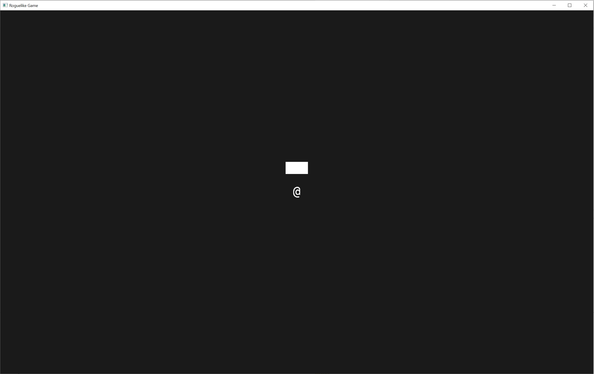

# Map creation and adding walls

## Moving player creation into separate files

Let's move the following code into `maps.rs`:
```rust, noplayground
use bevy::prelude::Component;

#[derive(Component)]
pub struct TilePosition {
    pub x: i32,
    pub y: i32,
    pub z: i32,
}
```

The fields are set to `pub` in order to get access to them from outside files.

And now we move the following code to `player.rs`:

```rust, noplayground
use bevy::prelude::{
    Commands, Component, Handle, SpriteSheetBundle, TextureAtlas, TextureAtlasSprite, Transform,
    Vec3,
};

use crate::map;

#[derive(Component)]
pub struct Player;

pub fn spawn_player(mut commands: Commands, texture_atlas_handle: Handle<TextureAtlas>) {
    commands
        .spawn()
        .insert(Player)
        .insert_bundle(SpriteSheetBundle {
            texture_atlas: texture_atlas_handle,
            transform: Transform::from_translation(Vec3::new(0., 0., 0.)),
            sprite: TextureAtlasSprite::new(94),
            ..Default::default()
        })
        .insert(map::TilePosition { x: 0, y: 0, z: 0 });
}
```

both of the files should have `mod` lines in `main.rs`:

```rust, noplayground
mod map;
mod player;
```

Now the game compiles with `cargo run` and we can see the same picture as before with "@" sign in the middle.

## Adding map resource

To add the map resource we change the `map.rs` file in the following way:
```rust, noplayground
use std::collections::HashMap;

use bevy::prelude::{Component, Entity};

const NUM_LAYERS: i32 = 5;

#[derive(Component)]
pub struct TilePosition {
    pub x: i32,
    pub y: i32,
    pub z: i32,
}

pub struct Map {
    pub forward: Vec<Vec<Vec<Option<Entity>>>>,
    pub backward: HashMap<Entity, TilePosition>,
    pub width: usize,
    pub height: usize,
    pub num_layers: usize,
    pub zero_pos: TilePosition,
}
impl Map {
    pub fn new(width: usize, height: usize, zero_pos_x: i32, zero_pos_y: i32) -> Map {
        let num_layers = NUM_LAYERS as usize;
        Self {
            forward: vec![vec![vec![None; width]; height]; num_layers],
            backward: HashMap::new(),
            width: width,
            height: height,
            num_layers: num_layers,
            zero_pos: TilePosition {
                x: zero_pos_x,
                y: zero_pos_y,
                z: 0,
            },
        }
    }
}
impl std::fmt::Display for Map {
    fn fmt(&self, f: &mut std::fmt::Formatter<'_>) -> std::fmt::Result {
        write!(f, "<Map width={} height={}>", self.width, self.height)
    }
}
```
`Map` struct has the following parts:
- The `forward` field of the struct is the map itself where we can find entities in a three-dimensional vector. Two dimensions are the positions on the screen and the third dimension is the layer
- The `backward` field is where we can identify where a specific entity is on the map. 
- `width`, `height` and `num_layers` are also stored there. 
- The constructor `new` creates empty `forward` and `backward` fields and sets the `width`, `height` and the `num_layers` of the `Map`.

We also added the implementation of the `std::fmt::Display` trait for debugging. Currently it does not print much but we will add more to it later.

In the `main.rs` file we created the map in `setup()`:
```rust, noplayground
    //Create the map
    let mut my_map = map::Map::new(
        usize::try_from(WINDOW_COLUMNS).ok().unwrap(),
        usize::try_from(WINDOW_ROWS).ok().unwrap(),
        WINDOW_COLUMNS / 2,
        WINDOW_ROWS / 2,
    );
```
And then added it to resources so we could use it in systems later. The lines are inserted at the end of `setup()` function:
```rust, noplayground
    // Insert map as a resourse
    commands.insert_resource(map);
```

Now the `setup()` function looks like this:
```rust, noplayground
fn setup(
    mut commands: Commands,
    asset_server: Res<AssetServer>,
    mut texture_atlases: ResMut<Assets<TextureAtlas>>,
) {
    // Setup the sprite sheet
    let texture_handle = asset_server.load("DejaVu Sans Mono22.png");
    let texture_atlas =
        TextureAtlas::from_grid(texture_handle, Vec2::new(TILE_WIDTH, TILE_HEIGHT), 31, 7);
    let texture_atlas_handle = texture_atlases.add(texture_atlas);

    // Add a 2D Camera
    commands.spawn_bundle(OrthographicCameraBundle::new_2d());

    //Create map
    let mut my_map = map::Map::new(
        usize::try_from(WINDOW_COLUMNS).ok().unwrap(),
        usize::try_from(WINDOW_ROWS).ok().unwrap(),
        WINDOW_COLUMNS / 2,
        WINDOW_ROWS / 2,
    );

    // Spawn the player
    player::spawn_player(&mut commands, texture_atlas_handle);

    // Insert map as a resourse
    commands.insert_resource(map);
}

```
Now move the code with constants to `contants.rs` file and add some more constants there. So now the new file contains the following:
```rust, noplayground
pub const TILE_WIDTH: f32 = 22.;
pub const TILE_HEIGHT: f32 = 36.;
pub const WINDOW_COLUMNS: i32 = 80;
pub const WINDOW_ROWS: i32 = 30;
```
We add the constants to `main.rs` like this:
```rust, noplayground
use constants::{TILE_HEIGHT, TILE_WIDTH, WINDOW_COLUMNS, WINDOW_ROWS};
```

Similar in `map.rs`:
```rust, noplayground
use crate::constants::{TILE_HEIGHT, TILE_WIDTH};
```

The code should compile, but nothing new is happening.

## Adding walls

Let's implement some methods for our `TilePosition` struct.
```rust, noplayground
impl TilePosition {
    pub fn new(x: i32, y: i32, z: i32) -> TilePosition {
        Self { x: x, y: y, z: z }
    }
    pub fn to_vec3(&self) -> Vec3 {
        Vec3::new(
            self.x as f32 * TILE_WIDTH,
            self.y as f32 * TILE_HEIGHT,
            self.z as f32,
        )
    }
}
```
The `new` method is a constructor that allows us to write coordinates without explicitly stating the name of the coordinate.

The `to_vec3` will be used later for sprite creation. Now our `tile_position_to_transform()` function is moved to `map.rs` and looks very simple:
```rust, noplayground
pub fn tile_position_to_transform(tile_position: TilePosition, mut transform: Mut<Transform>) {
    transform.translation = tile_position.to_vec3();
}
```
An empty struct is added to the code as a Component to identify walls:
```rust, noplayground
#[derive(Component)]
pub struct Wall;
```

Now we add another function to `impl Map`:
```rust, noplayground
    fn spawn_a_wall(
        &mut self,
        commands: &mut Commands,
        texture_atlas_handle: &Handle<TextureAtlas>,
        position: TilePosition,
    ) {
        let id = commands
            .spawn()
            .insert(Wall)
            .insert_bundle(SpriteSheetBundle {
                texture_atlas: texture_atlas_handle.clone(),
                transform: Transform::from_translation(position.to_vec3()),
                sprite: TextureAtlasSprite::new(186), // Full fill
                ..Default::default()
            })
            .insert(position.clone())
            .id();
        let corrected_x = position.x + self.zero_pos.x;
        let corrected_y = position.y + self.zero_pos.y;
        let corrected_z = position.z + self.zero_pos.z;
        self.forward[usize::try_from(corrected_x).ok().unwrap()]
            [usize::try_from(corrected_y).ok().unwrap()]
            [usize::try_from(corrected_z).ok().unwrap()] = Some(id.clone());
        self.backward.insert(id.clone(), position.clone());
    }
```
This function will allow us to insert a wall from the `setup()` function in `main.rs`. Creation of the entity, adding a `Wall` component and inserting the sprite is very similar to the player code. Only now we choose number `186` from the texture, because we represent the wall with a filled rectangular. After adding `TilePosition` component we also return the `Entity` struct so that we could save the entity to the map. Then the position is converted from world coordinates that can be negative to map coordinates that are positive.

With `self.forward` we then add the entity to the 3d vector.

In addition we also add the entity and the position to `self.backward` so we could find the position in the array based on `id`.

The next function is the function that will be called from `setup()` in `main.rs` to add three walls:
```rust, noplayground
    pub fn spawn_walls(
        &mut self,
        commands: &mut Commands,
        texture_atlas_handle: &Handle<TextureAtlas>,
    ) {
        self.spawn_a_wall(commands, texture_atlas_handle, TilePosition::new(-1, 2, 0));
        self.spawn_a_wall(commands, texture_atlas_handle, TilePosition::new(0, 2, 0));
        self.spawn_a_wall(commands, texture_atlas_handle, TilePosition::new(1, 2, 0));
    }
```
So in the function we just repeat the call to `spawn_a_wall` function with different coordinates.


and also add the following line in `setup()` function in `main.rs` to spawn the walls:
```rust, noplayground
    my_map.spawn_walls(&mut commands, &texture_atlas_handle);
```

```rust, noplayground
fn setup(
    mut commands: Commands,
    asset_server: Res<AssetServer>,
    mut texture_atlases: ResMut<Assets<TextureAtlas>>,
) {
    // Setup the sprite sheet
    let texture_handle = asset_server.load("DejaVu Sans Mono22.png");
    let texture_atlas =
        TextureAtlas::from_grid(texture_handle, Vec2::new(TILE_WIDTH, TILE_HEIGHT), 31, 7);
    let texture_atlas_handle = texture_atlases.add(texture_atlas);

    // Add a 2D Camera
    commands.spawn_bundle(OrthographicCameraBundle::new_2d());

    //Create the map
    let mut my_map = map::Map::new(
        usize::try_from(WINDOW_COLUMNS).ok().unwrap(),
        usize::try_from(WINDOW_ROWS).ok().unwrap(),
        WINDOW_COLUMNS / 2,
        WINDOW_ROWS / 2,
    );
    my_map.spawn_walls(&mut commands, &texture_atlas_handle);

    // Spawn the player
    player::spawn_player(&mut commands, texture_atlas_handle);

    // Insert the map as a resourse
    commands.insert_resource(my_map);
}
```

Now it compiles and we can see the walls. If we move to the walls they do not prevent us from moving to their tiles. This is the next chapter.


The final code could be found here:
[Chapter03 code](https://github.com/keiv-fly/rust_bevy_roguelike_tutorial/tree/main/code/chapter03)
